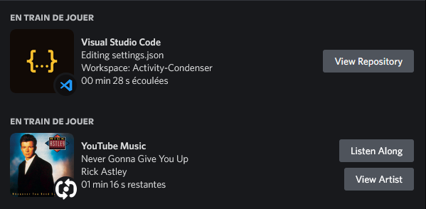

<h1 align="center">Activity Condenser</h1>

#### [
]() *(A powerful python software to condense multiple discord Activities into a single animated one)*
[
]()

[
]()

---
### **<ins>
Terms of use :
**
- This project is under MIT liscense you MUST follow this LICENCE
- This is not an obligation but a request: please do not use this project for: commercial use - closed source use - please credit me. Thanks !

---

### **<ins>
Screenshots :
**

 *Without Activity Condenser*

&nbsp;

 *With Activity Condenser*

---

### **<ins>
Activity Condenser features and limitaions
**

## **Features :**
- Condense multiple players activity into a single one
- Check updates 
- Windows 11 style
- Custom refrseh time
- Custom User picker
- Custom Bot Token
- Custom App ID
- Start with windows (buggy)
- Auto Light/Dark mode switching
- Auto check for update on start
- Installation of the application with the modules provided + python + modification of a module automatically
- Update With auto launch GUI
- Update GUI

## **Limitaions :**
- Cannot change the main title text
- Cannot set a refresh time less than 15 seconds
- Cannot create working buttons (buttons are displayed but not working)
- For now you need to create a discord server or invite your bot to one of your discord servers to be able to run the app

ALL (except the last one) of these limitations are due to discord limitations. THEY ARE NOT FIXABLE as long as discord does not update its api

This is not an exhaustive list. Install Activity Condenser to see all it can do!
  
Do you like the project? Leave a ⭐ star on the repo!

---

### **<ins>
Planed Activity Condenser features
**

- Restart app when updating settings (+ show why the app doesn't start under the settings that make the app crash)
- Display the right icon on the taskbar when opening a gui
- Create a workaround for the button link (maybe a better discord optional plugin? I dont know maybe a script to paste in the discord console if you have any idea tell me!)
- And clean the code a little bit (you can help me of course !)

Of course you can help me with pull requests !

---

### **<ins>
Do you need help using the software? :
**

The wiki is under developpment

---
### **<ins>
Download :
**

You can download the software from [GitHub Releases](https://github.com/Fefedu973/Activity-Condeser/releases).

Supported platforms :

- Windows 

---

 

If you like this project and want to help develop it, you can donate to us on [Paypal](https://www.paypal.me/).

If you have any questions, problems or suggestions, feel free to join our discord:

 

[
](https://discord.gg/Q8tSgzvDWQ) 
---

 
 

[
]() *Readme made by [@Fefe_du_973](https://github.com/Fefedu973)*  

